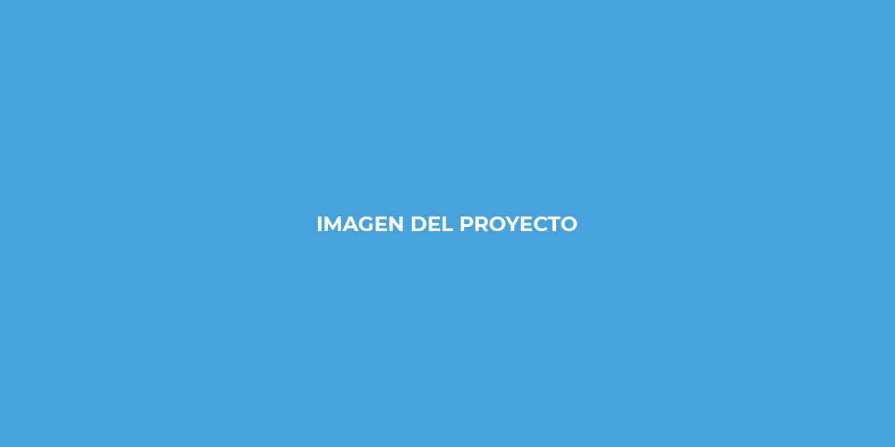

# Portafolio y CV de Juan David Ruiz Anturi

Este repositorio recoge las plantillas base y ejemplos que utilizo para documentar mi perfil profesional, mis proyectos y mi CV como desarrollador de software.

## Sobre mí 👨‍💻

Soy **Juan David Ruiz Anturi**, Técnico en Sistemas y **Tecnólogo en Análisis y Desarrollo de Software** formado en el **SENA Centro ASTIN**.

Me especializo en el desarrollo de aplicaciones web orientadas a:

- Sistemas de **inventario** y gestión de stock.
- **Aplicaciones fullstack** con frontend moderno y backend en Python.
- Proyectos de **modelos de IA / ML** aplicados a la web.
- **Ecommerce** y plataformas de **cursos online**.

## Proyectos Destacados 💻

- 📦 **Sena_Inventario_Desarrollo** (Django)
  - Repositorio: https://github.com/Reaper2719/Sena_Inventario_Desarrollo
  - Sistema de inventario desarrollado en el contexto del SENA, con gestión de productos, proveedores y movimientos de stock.

- 🧾 **Inventario**
  - Repositorio: https://github.com/JuanRuiz0822/Inventario
  - Otra implementación de inventario que refuerza el modelado de datos y las reglas de negocio de stock.

- 🤖 **MODELSIA**
  - Repositorio: https://github.com/JuanRuiz0822/MODELSIA
  - Proyecto centrado en modelos de IA/ML, pensado para integrar modelos en aplicaciones web (por ejemplo, recomendaciones o clasificación).

- 🛍️ **Stylish** (Ecommerce de ropa elegante)
  - Repositorio: https://github.com/JuanRuiz0822/Stylish
  - Frontend de ecommerce de ropa elegante, con catálogo de productos y experiencia de usuario moderna.

- 🎓 **CursosOnline** (demo)
  - Repositorio: https://github.com/JuanRuiz0822/CursosOnline
  - Demo de plataforma de cursos online, con estructura de cursos y lecciones.

- 🌐 **CEAI-WEB** (Fullstack)
  - Repositorio: https://github.com/Reaper2719/CEAI-WEB
  - Proyecto fullstack web que integra frontend y backend.

## Cómo uso este repositorio 📑

En este repo mantengo plantillas de documentación para reutilizar en mis proyectos:

- `readme_perfil_github.md`: plantilla personalizada de mi **perfil de GitHub**, que uso como base para el `README.md` del repositorio `JuanRuiz0822/JuanRuiz0822`.
- `readme_proyecto.md`: ejemplo de **README de proyecto** orientado a mi sistema de inventario SENA, que utilizo como guía para documentar otros proyectos (MODELSIA, Stylish, CursosOnline, etc.).
- `Trabajo.pdf`: documento de referencia con información y pautas para preparar el CV y el perfil profesional.

## Contacto 📫

- Portafolio: https://juanruiz0822.github.io/Reaper2719.github.io
- GitHub: https://github.com/JuanRuiz0822
- Email: tu-correo-real@dominio.com
- LinkedIn: https://www.linkedin.com/in/tu-url-de-linkedin/

## Licencia 📄

MIT Public License v3.0
No puede usarse comercialmente.
